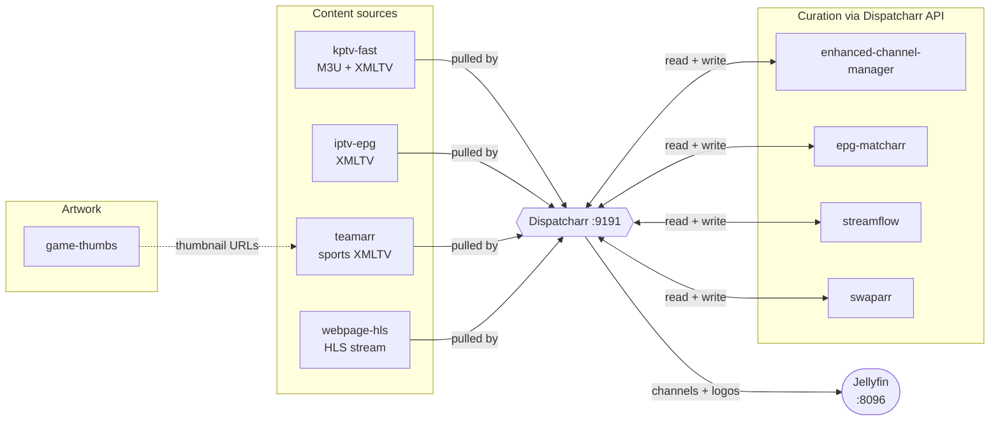

# Dispatcharr Tools

Nine companion services around [Dispatcharr](../app/), the IPTV channel manager. Each is
its own Flux `Kustomization` in [`../ks.yaml`](../ks.yaml).

> **Five of them do not run in their own pod.** `kptv-fast`, `iptv-epg`, `teamarr`,
> `webpage-hls` and `game-thumbs` all fetch from the public internet,
> so they run as containers inside the **Dispatcharr pod** to share its gluetun VPN tunnel.
> Their images, env, probes and resources live in
> [`../app/helmrelease.yaml`](../app/helmrelease.yaml); the directories here keep only their
> PVC and HTTPRoute. Full rationale in [`../app/README.md`](../app/README.md#co-located-tools).
>
> Every Service name and published port was preserved, so nothing below changes address.
> The other four keep their own Deployments and declare `dependsOn: dispatcharr`; the two
> co-located tools that own a PVC have that dependency reversed, since the Dispatcharr pod
> mounts their claims.

> **On the URLs below:** which M3U accounts and EPG sources Dispatcharr actually has
> registered lives in Dispatcharr's own Postgres database, not in Git. The URLs given here are
> the integration points each tool exposes — verify the live wiring in the Dispatcharr UI
> under *M3U Accounts* and *EPG Sources*.

They fall into three roles (★ = runs inside the Dispatcharr pod, on the VPN):

| Role | Tools |
|---|---|
| **Feed content in** — Dispatcharr pulls M3U/XMLTV from them | `kptv-fast`★, `iptv-epg`★, `teamarr`★, `webpage-hls`★ |
| **Curate what's there** — they call the Dispatcharr API | `enhanced-channel-manager`, `epg-matcharr`, `streamflow`, `swaparr` |
| **Artwork** | `game-thumbs`★ |

## Feeding content into Dispatcharr

### `kptv-fast` — free ad-supported (FAST) channel aggregator

Aggregates public FAST providers into one playlist and one guide. Its UI ("KPTV FAST
Streams") exposes:

- `/playlist` — combined M3U, plus `?provider=` for a single source
- `/epg` and `/epg-gz` — combined XMLTV, likewise filterable
- `/channels`, `/clear_cache`, `/debug`

Providers enabled via `ENABLED_PROVIDERS: all`: plex, pluto, samsung, lg, distrotv, tubi,
xumo, roku, localnow, firetv, git_freetv, git_iptv. A recent build produced **10,466
channels / 408,229 programmes**. `GIT_COUNTRY`/`LG_COUNTRY`/`WHALE_COUNTRY` are pinned to
`us,ca`.

Dispatcharr points at `http://kptv-fast.media.svc.cluster.local:8080/playlist` as an M3U
account and `/epg` as an EPG source. The 6 Gi memory limit is deliberate — building the
combined EPG parses >230 MB of XML in memory and OOMKilled at 1 Gi.

> **These providers are US-geolocked and this container now egresses through the UK exit.**
> If a provider starts returning an empty playlist, check that before blaming the
> aggregator.

> The `stirr` provider currently 404s upstream (`i.mjh.nz/Stirr/all.xml` is gone). Harmless;
> the other providers still build.

### `iptv-epg` — scraped XMLTV guide

Runs [`iptv-org/epg`](https://github.com/iptv-org/epg) to scrape `zap2it.com` and
`tvguide.com` into `/epg/public/guide.xml`, then serves that directory over pm2. Currently
**152 channels / 8,814 programmes**.

Dispatcharr points at `http://iptv-epg.media.svc.cluster.local:3000/guide.xml` as an XMLTV
source — unchanged, though the container now listens on **:3003** because `vpn-ui` holds
`:3000` in the shared namespace. pm2 runs `npx serve -- public`, and `serve` reads `PORT`.
Grabs run at **03:00** (`CRON_SCHEDULE`) plus once at boot (`RUN_AT_STARTUP`), and the
Dispatcharr pod's `strategy: Recreate` prevents two grabs writing `guide.xml` concurrently.

This is the only tool with **no HTTPRoute** — it's cluster-internal, since nothing but
Dispatcharr needs it. `tvtv.us` is unusable from this network (Cloudflare 1020 on every
request), which is why only two sites are enabled. Both remaining sites are US-hosted and
now reached through the UK exit; an empty grab is a geoblocking suspect.

### `teamarr` — dynamic sports EPG

Self-described as a "Sports EPG generation service". Builds guide data for sports channels
from league/team metadata (**168 mappings across 7 providers and 17 sports**, plus 216 ESPN
soccer leagues cached at startup).

It goes further than a plain source — its API includes `/api/v1/channels/dispatcharr/{id}`,
`/api/v1/channels/managed`, and `/api/v1/channels/reconciliation/*`, so it both generates
EPG *and* manages the Dispatcharr channels it generates for.

Its Dispatcharr connection is configured **in the teamarr UI**, not via env — there is no
`DISPATCHARR_URL` in the HelmRelease. State lives in `teamarr.db` on the `teamarr-data` PVC.

### `webpage-hls` — webpage → HLS transcoder

Runs [`ws4kp-to-hls`](https://github.com/sethwv/ws4kp-to-hls): renders a web page in headless
Chromium and re-encodes the result as an HLS stream, so a website becomes a watchable
channel. Built for [WeatherStar 4000+](https://github.com/netbymatt/ws4kp).

- `/weather?city=…` — the packaged weather channel
- `/stream?url=…` — any arbitrary page (400 without `url`)
- `/health` — liveness (`/` returns 404 **by design**)

The container listens on **:3001** (`PORT`) to stay clear of `vpn-ui`; its Service still
publishes `:3000`. It also runs a **second** server — the embedded WeatherStar it
screenshots — on `WS4KP_PORT`, moved to **:8081** because the image defaults it to `:8080`
and that is `kptv-fast`'s port. Purely pod-internal; the app builds its own
`http://localhost:8081` URL from the same variable.

It also validates a background music library at startup (66 audio files → a 1,320-track
shared playlist). Dispatcharr ingests the resulting HLS URL as a custom stream. The 2 Gi
limit and the writable `/tmp`, `/streaming-app/cache`, `/home/node/.cache` mounts exist
because of the headless browser.

## Curating what's already in Dispatcharr

### `enhanced-channel-manager` (ECM) — bulk channel operations

The heaviest tool here. Channel pipelines (a rules engine with an evaluator, executor and
rule analyzer), name normalization and abbreviation tags, bandwidth tracking, an M3U change
monitor, backup/restore, and alerting over SMTP/Discord/Telegram.

Ships a **second container**, `enhanced-channel-manager-mcp`, exposing ECM's operations as
MCP tools for LLM agents. It's a sidecar in the same pod, so they talk over localhost
(`MCP_HOST: http://localhost:6101`, `ECM_URL: http://localhost:6100`) rather than the
Service.

All state — `settings.json` (including the Dispatcharr connection), `auth_settings.json`,
`journal.db`, `uploads/`, `tls/` — lives in `CONFIG_DIR=/config` on the
`enhanced-channel-manager-config` PVC. Without that PVC every restart wiped the config and
`m3u_change_monitor` failed on each poll with `URL is missing an 'http://' or 'https://'
protocol`.

### `epg-matcharr` — channel ↔ EPG matching

Matches Dispatcharr channels against available EPG entries, so guide data lands on the right
channel. Reads `DISPATCHARR_URL` from env; the API token is set **through its UI on first
run**. `DISPATCHARR_TOKEN` is deliberately left unset rather than pinned empty, because env
vars take priority over UI settings there.

### `streamflow` — stream quality checking and auto-assignment

Probes every stream behind a channel with ffmpeg, then reorders or reassigns them by measured
quality. Maintains a "UDI" index of Dispatcharr's channels and streams (last seen: 8
channels, 21,346 streams) and runs an automated stream manager that keeps per-channel
patterns.

Because a single quality-check request runs ffmpeg against many sources, it needs both real
memory (4 Gi limit) and [`backendtrafficpolicy.yaml`](streamflow/backendtrafficpolicy.yaml),
which raises the Envoy request timeout from the 15 s default to **1800 s**.

> Its stored Dispatcharr base URL currently points at the *external* hostname, so it
> authenticates through the gateway and gets rate-limited (`429`, leaving stream-ID fetches
> `401`). `DISPATCHARR_BASE_URL` in the HelmRelease already points at the in-cluster Service —
> the UI-stored value overrides it, so the fix belongs in the StreamFlow UI.

### `swaparr` — live stream override control

A lightweight nginx-served UI titled "Swaparr — Stream Override Control", with a *Live
Streams* view and an *All Channels Browser*. Use it to override, by hand, which stream a
channel is currently serving — the manual counterpart to StreamFlow's automation. Stateless;
all reads and writes go straight to `DISPATCHARR_URL`.

The root filesystem is left writable because nginx-alpine writes to `/etc/nginx/conf.d`,
`/var/cache/nginx` and `/var/run` at startup.

## Artwork

### `game-thumbs` — per-event thumbnail generation

Generates thumbnail artwork for sports events, consumed by URL. Pairs naturally with
`teamarr`: teamarr produces the sports guide entries, game-thumbs supplies matching images.
Rate-limited to 90 requests/minute, with an in-pod `emptyDir` at `/app/.cache`.

Its HTTP surface is unusual — most paths return **444**, but `/health` returns a normal
JSON 200, so the `tcpSocket` probe is more conservative than necessary; a `/health` httpGet
would work. The container listens on **:3002** (`PORT`) to stay clear of `vpn-ui`; its
Service still publishes `:3000`.

## Daily pipeline order

The cron schedules are staggered so each stage runs after its inputs are ready:

| Time | What runs |
|---|---|
| 03:00 | `iptv-epg` grabs guide data; Jellyfin refreshes its XMLTV guide |
| 04:00 | `streamflow` pipeline |

`kptv-fast` is independent, refreshing on its own `CACHE_DURATION` (7200 s) and warming both
cache and EPG at startup. `teamarr` runs its own hourly cron.

## Conventions across these tools

**Where config actually lives.** Only `streamflow`, `swaparr` and
`epg-matcharr` get their Dispatcharr URL from env. `teamarr` and `enhanced-channel-manager`
store the whole connection — credentials included — in their own database, set through their
UI. Nothing in Git will reproduce that; it's why ECM needs a PVC.

**Cluster-internal addressing.** Tools should reach Dispatcharr at
`http://dispatcharr.media.svc.cluster.local:9191`, never the external hostname — the gateway
applies rate limits that will throttle a busy tool (see the StreamFlow note above). The
co-located tools can use `http://localhost:9191` instead.

**NFS ownership.** The `nfs-slow` storage class presents as `99:100` and can't be chowned
from a container, so every tool with a PVC on it runs with `runAsUser: 99`, `runAsGroup: 100`,
`fsGroup: 100` and `fsGroupChangePolicy: OnRootMismatch` — matching Dispatcharr itself. ECM is
the exception: it runs as root, since its image expects to write files owned by its own
`appuser`. For `teamarr` this is now set **per container** rather
than pod-wide, because they share a pod with Dispatcharr's image, which starts as root and
drops to `PUID`/`PGID` itself.

**Port uniqueness.** Only inside the Dispatcharr pod, where one network namespace is shared:
`iptv-epg`, `webpage-hls` and `game-thumbs` were moved off `:3000` to `:3003`, `:3001` and
`:3002`. Their Services still publish `:3000` and retarget, so no consumer — including the
URLs stored in Dispatcharr's database — sees a change. Also unavailable in that pod: `53`,
`5656`, `8000`, `8001`, `9191`, `9999`, and `8081` (webpage-hls's embedded WeatherStar).

A container may bind ports it does not advertise — that is what collided `webpage-hls` with
`kptv-fast` on the first deploy. Comparing Service ports is not enough; check the pod's real
listeners with `grep " 0A " /proc/net/tcp` before adding a container.

> A stale NFS handle on one of these volumes surfaces as `unable to open database file` or
> `Stale file handle` while the PVC still reports `Bound`. A pod restart remounts it; the data
> is intact.

**No Gatus checks.** These tools are deliberately unmonitored — Dispatcharr itself keeps its
check. `game-thumbs` (444 on `/`) and `webpage-hls` (404 on `/`) would each have needed a
custom path or status anyway.

**Image pinning.** Everything is pinned by tag *and* digest for Renovate. `iptv-epg`,
`kptv-fast` and `webpage-hls` publish no version tags, so they track a rolling
tag by digest. For the six co-located tools, that means a Renovate bump **restarts
Dispatcharr** and drops in-flight streams — accepted deliberately, but it is the reason to
pin those rolling tags if the churn ever gets annoying.
